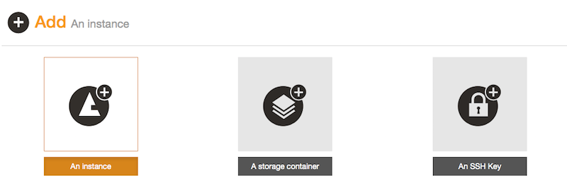
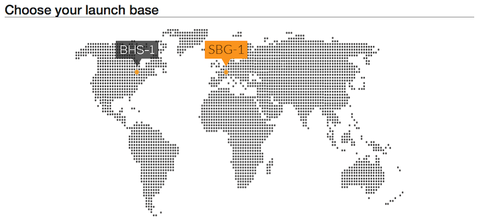
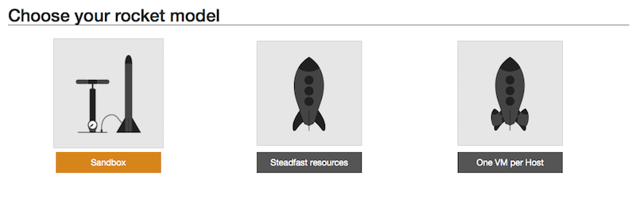
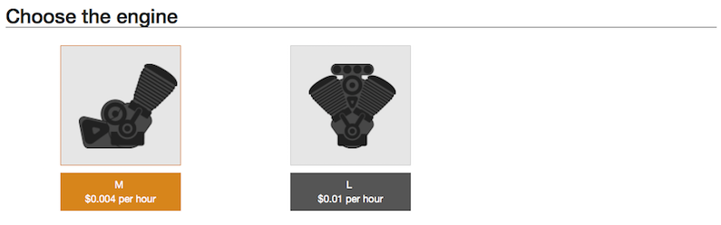
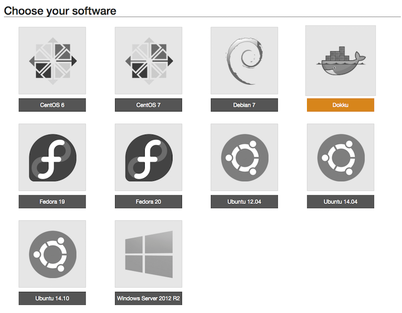

# Songbook on RunAbove

This tutorial presents how to create a songbook server on [RunAbove](https://www.runabove.com/index.xml) by [OVH](https://www.ovh.com/fr/index.xml). It will only take a few minutes. It will help you create a RunAbove instance and install a [Dokku](https://github.com/progrium/dokku) based server to run songbook through [Docker](https://www.docker.com).

**Pre-requisites**: 

- You need an active RunAbove account.
- A SSH Key pair installed on RunAbove (tutorial [here](https://community.runabove.com/kb/en/instances/create-ssh-keys.html)).

## Create an instance

You first need to create an instance. An instance is a running computer where you can launch songbook. Go to [RunAbove](https://www.runabove.com/index.xml), sign in and go to [Add](https://cloud.runabove.com/#/add) tab. From there, follow these steps:

- Add `An Instance`:

- `Choose your launch base`: Here you choose where in the world is located your instance. Choose where ever you wan't:

- `Choose your rocket model`: Songbook is small and fast any model will do. You can take the smallest one. For instance `SandBox` is nice:

- `Choose the engine`: Even the smallest can easily run Songbook. You can take the smallest one:

- `Choose your software`: Choose [Dokku](https://github.com/progrium/dokku) a small distribution that includes [Docker](https://www.docker.com):

- Give a name to your new rocket and `Fire up !`:

- On 'Instances' tab yours will appear.

## Connect to your instance

Your server is up and running, now you can install songbook on. Now you need to: 

- Copy past on a terminal the access command (`ssh admin@ip_address`).
- The instance runs a nginx server, you need to stop it before running songbook. Stop the running nginx with the command: 

      sudo /etc/init.d/nginx stop
	
- Now you can start songbook using Docker with the command:

      sudo docker run -p 80:80 kawane/songbook

Now your server is up and running, check the [Getting Started](Getting_Started.md) to add your songs.
